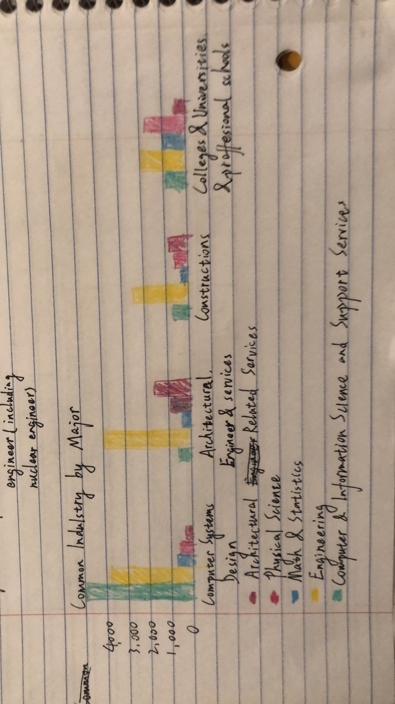
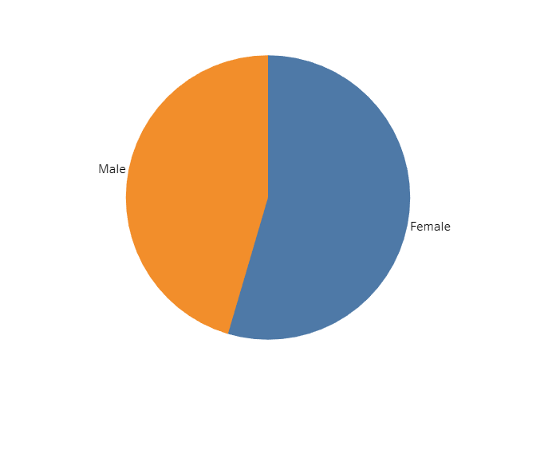

Link to [Final Project](https://albertzhong-95.github.io/Final-Project_Han-Zhong/).  
  
# Outline
  
*Summary*  
This Final Project is aimed to tell people the story of the graduates from CMU and the information industries to help students develop a better career plan in the future.
  
*Structure*  
I will focus on their majors and career situation after they graduated.
Information will include graduates' majors,  
occupation choices,    
and their average salaries.  
  
Those information will be analysed based on gender, major, and race.  
Because I am a student in Heinz College, after the introduction to graduates' major and career, I will dig geeper into the information indulstries, compare our graduates information to other graduates from different universities, and the overall information in the information indulstry. I reckon that, after more stories about the information indulstries, the Heinz students will learn more about our future career, and develop a better career plan.
  
# Initial Sketches
Female graduates majors:  
  
Male graduates majors:  
  
Other universities graduates occupation choices(University of Pittsburgh):  
.png)  
Overall Salary in Information Indulstry:  
  
  
# Data
Link to [Data Folder](https://github.com/albertzhong-95/Final-Project_Han-Zhong/tree/master/data).  
In this folder, there is data about CMU's students majors, occupations after graduate, other universities graduates' data(JHU, Pitt, etc.), and data about information indulstry. There will be more data added into this folder with my development of my final project. They are collected from data.gov, Data USA, and Western Pennsylvania Regional Data Center.  
For the data about CMU's graduates majors, occupations, average salaries, I plan to use them as the introduction to audiences to give them a first impression about CMU's graduates. Those data will be visualized into bar charts, tree maps, etc.  
For the data about other universities' graduates, I will use it to compare with the data of CMU's graduates to help audiences build an understanding about our discipline superiority and inferiority. Those data will be visualized into bar charts, line charts, etc.  
For the data about the information indulstry, I would like to focus on demonstrating the job opportunities, job income to assist audiences develop a better career plan. Those data will be visualized into bar charts, cluster maps, maps, etc.  
  
# Method and Medium
I will build my story on Shorthand. For the data visualization, I plan to use Tableau and RawGraphs. Moreover, I plan to find the images I need from Getty Image.

# User Research
Link to [user research protocol and findings](https://drive.google.com/file/d/1F4xXjzxW_-qyB6vrO4tP1dBQw5z57y1x/view?usp=sharing).
  
# Design  
Link to [StoryBoard](https://carnegiemellon.shorthandstories.com/-learn-more-about-heinz-graduates-occupation-choices-/index.html).  
  
We are all graduate students of CMU, so I reckon that the information about CMU graduates and their career prospects should be appealing to us.
First of all, let’s look into some basic information about those CMU graduates.
All of the sketches will be replaced.
**Introduction to CMU Graduates**  
*Common Industry by Major*  
  
*Majors Awarded*  
  
*Occupations of Heinz Students*  
  
  
**Career Prospects**  
*Salary*  
  
*Location*  
  
*Age*    
  
*Gender*  
  
*Working Hours*   
No Sketches Yet.
  
**Conclusion**  
The highest paying industries of Computer and Information Sciences and Support Services majors, by average wage, are Internet publishing, broadcasting & web search portals, Other consumer goods rental, and Sound recording industries. The highest paying industries of Business majors, by average wage, are Oil & gas extraction, Computer & peripheral equipment manufacturing, and Securities, commodities, funds, trusts & other financial investments.  
California, Texas, New York, Seattle pay well.  
For any students who are less than 42, we should have a great development space in our career.  
We shouldn’t worry too much about the gender imbalance.  
  
# Intended Audience
My target audiences are Heinz students, and those people who are considering to become a student in Heinz. Help them build a more comprehensive and better understanding about Heinz and their future onece they graduate.  
  
# Summarize
I have found four data sets of CMU graduates, Pittsburgh University graduates, MIT graduates, and Georgia Tech graduates on DATA USA. Because majors Heinz students falls into two categories of thoes data set, either information technology, or information management. So I extract all them data which is information technology/information management majors from those four data sets. Use Tableau, RawGraphs, and R to compare those graduates salary, working hours, gender, age grouped by occupations. Then use shorthand to build the story based on my visualized data.  
  
# Reference
Link to [CMU Data](https://datausa.io/profile/university/carnegie-mellon-university#graduates);  
Link to [MIT Data](https://datausa.io/profile/university/massachusetts-institute-of-technology);  
Link to [Pitt Data](https://datausa.io/profile/university/university-of-pittsburgh-pittsburgh-campus);  
Link to [Georgia Tech Data](https://datausa.io/profile/university/georgia-institute-of-technology-main-campus);  
Link to [Data Folder](https://github.com/albertzhong-95/Final-Project_Han-Zhong/tree/master/data). 
